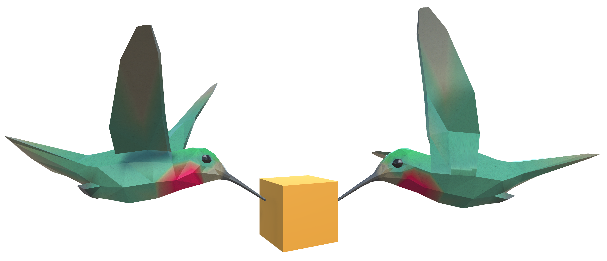

# Colibri

Provides easy model synchronization and easy access to data for faster cross reality prototyping.

## Requirements

- Unity 2019.4 or higher
- NodeJS 12 or higher (for the server; also available on DockerHub)

## More information coming soon
