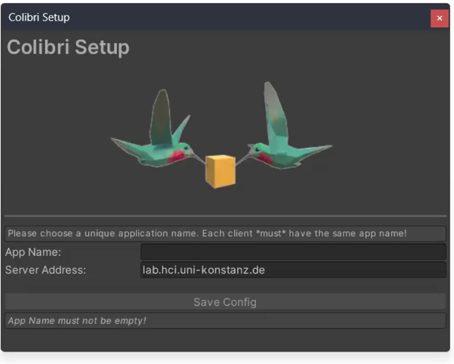
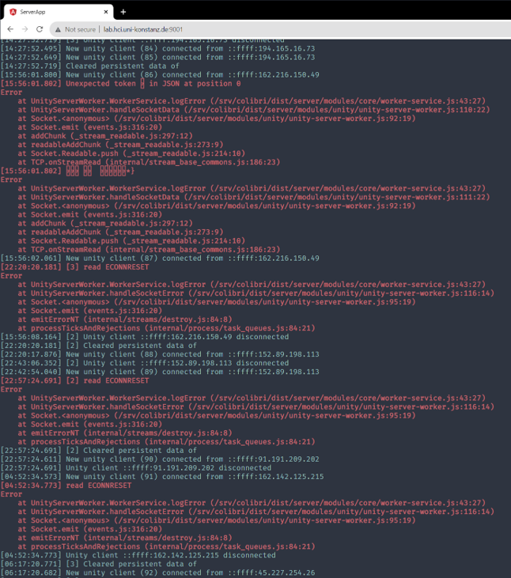
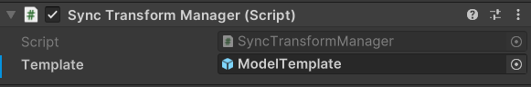

# Colibri Unity

## Requirements

Unity 2019.4 or higher

## Installation

### UPM

Add the following Git URLs to the Unity Package Manager:

- `https://github.com/Cysharp/UniTask.git?path=src/UniTask/Assets/Plugins/UniTask`
- `https://github.com/neuecc/UniRx.git?path=Assets/Plugins/UniRx/Scripts`
- `https://github.com/hcigroupkonstanz/Colibri.git?path=colibri-unity/Assets/Colibri`

### UnityPackage

Download the latest release from GitHub and import it to your Unity project.


### Configuration

Upon installation, a configuration window should show up:



- Enter the URL of your (shared) [server](../colibri-server). A public test server can be found at `colibri.hci.uni-konstanz.de` (beware of network latency!)
- Choose a unique *app name*. Though a server supports multiple clients, data is only synchronized between clients with identical *app names*!
- To adjust the Colibri Configuration you can reopen the window in Unity under "Window" -> "Colibri Configuration" 
- All changes are saved to `Resources/ColibriConfig`

## Samples

Samples can be found in the `Colibri/Samples` folder (when installed via UnityPackage) or imported through the Package Manager in the `Samples` tab (when installed via UPM).


## Documentation

### Web Interface for Logging



Colibri provides a *web logger* with web interface to send diagnostic data (currently: console logs) to the server. This may be useful for devices (e.g., VR devices, smartphones) where access to the console is not easily available.

To setup, add the `[RemoteLogger]` prefab to your scene (or the `RemoteLogging` script to the scene). The Unity log output should be redirect to your server's webinterface, which can be accessed via `http://<your-server-ip>:9011`.


### Sending Data between Clients

Colibri supports simple data transmission via pub/sub communication. Data can be published from anywhere in
the executed code, as illustrated with the following simple example of sending a float value (myFloat) on a "click" channel:

```c#
float myNumber = 5;
Sync.Send("click", myNumber);
```

The sent data can then be received anywhere within Unity by registering a listener:

```c#
Sync.Receive("click", (float myFloat) => {
    // Will be called whenever a float on "click" channel is received
});
```

The listener can be deregistered via:

```c#
Sync.Unregister("click", MyMethod);
```

The following built-in types are available for sync: `bool, int, float, string, Vector2, Vector3, Quaternion, Color` and arrays thereof. For arbitrary data, you can use JSON (via Newtonsoft.JSON): 

```c#
Sync.Send("myJson", new JObject
{
    { "attribute1", "example" },
    { "attribute2", 5 }
});

Sync.Receive("myJson", (JToken obj) => { /* ... */ });
```

Limitations:

- You have to register the listener *before* sending out data
- Type and channel *must* match between Listener and Sender
- Remember to unregister your listener where necessary!
- Due to overloading, some methods may have to be cast explicitly: `Sync.Receive("...", (Action<JToken>)OnJsonMessage);`


### SyncTransform

For synchronizing the location of an object, Colibri provides a `SyncTransform` script. Simply attach the script to an object, and its position, rotation, and scale will be synchronized between all clients. See SyncTransform samples for more information.

Information about the object's state is stored on the server. When a new client connects, the location is automatically updated to its current state.

`SyncTransform` also supports physics. `PhysicsAuthority` defines which client is currently controlling the physics. Only one client can control the physics of an object at a time. If the `PhysicsAuthority` is set to `true` on one client it is automatically set to `false` on all other clients. If the `PhysicsAuthority` is checked by default, the first client receives the physics authority. The `isKinematic` field of the attached `Rigidbody` will be overwritten by the `isKinematic` field of the `SyncTransform`. Therefore, if you want to change this field, always (additionally) set the `isKinematic` field of the `SyncTransform`.

For dynamically created objects, add the `[SyncTransformManager]` prefab to the scene and add the prefab of the objects you'll instantiate to the `Template` attribute. When a client instantiates a script with `SyncTransform`, the Manager will automatically create an object using this prefab and synchronize its position.



Limitations:

- Only one client can update the each attribute of the object simultaneously
- Scene will be reset once all clients disconnect


### Remote Store

Colibri offers persistent data storage on the server, so that data can be shared easily between connected clients. Objects can be uploaded via a RESTful interface of the `Store` object:

```c#
// Create example object
ExampleClass exampleObject = new ExampleClass();
exampleObject.Id = 1234;
exampleObject.Name = "Charly Sharp";

// Save example object using REST API
bool putSuccess = await Store.Put("exampleObject", exampleObject);
Debug.Log($"Success: {putSuccess}");

```

or retrieved again:

```c#
ExampleClass exampleObjectGet = await Store.Get<ExampleClass>("exampleObject");
if (exampleObjectGet != null)
{
    // Use fetched "exampleObjectGet"
}
else
{
    Debug.LogError("Get Example Object failed!");
}
```

Limitations:
- Data fetching happens manually (data won’t be automatically updated!)
- If you want to synchronize custom classes, use the built-in `[Serializable]` attribute on your class


### SyncBehaviour

For more complex scenarios, Colibri supports synchronization of data models (e.g., for use in model-view-controller architectures). For this, we need a *Model* script and a *Manager* script.

The model script has to inherit from `SyncBehaviour<T> `instead of `MonoBehaviour`:

```c#
public class MyClass : SyncBehaviour<MyClass>
{
    [Sync]
    public string MyString = "123";

    [Sync]
    private Vector3 Position
    {
        get { return transform.localPosition; }
        set { transform.localPosition = value; }
    }
}
```

While the manager just requires a declaration matching the model script:

```c#
public class MyClassManager : SyncBehaviourManager<MyClass>
{
    // No code necessary – just add this script
    // to your scene (e.g., on an empty GameObject)
}
```

The manager should be added to your scene (e.g., on an empty GameObject), and the manager requires a Prefab with the model script for synchronizing different objects. 

By the way: `SyncTransform` is also a `SyncBehaviour`.

Limitations:
- Only one client can update each attribute of the object simultaneously
- Scene will be reset once all clients disconnect


### Voice Transmission

Work in progress

See `Samples/VoiceTransmission` 

